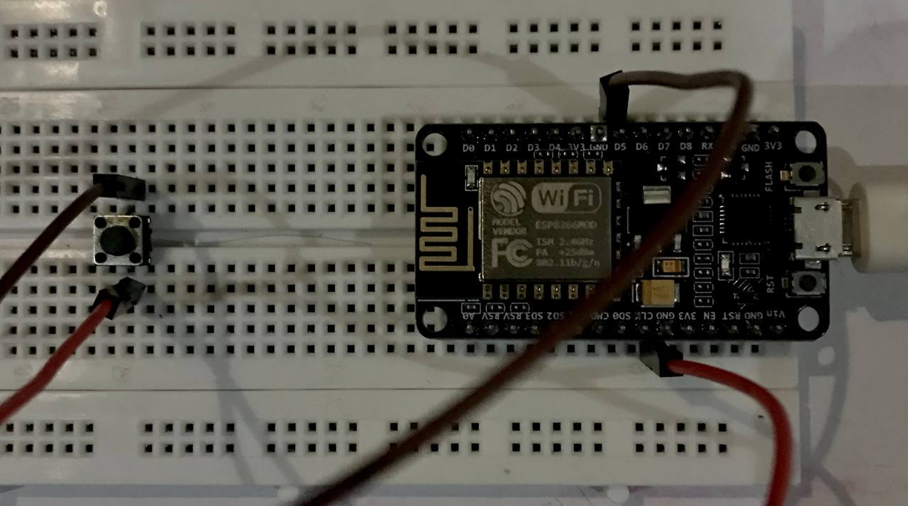
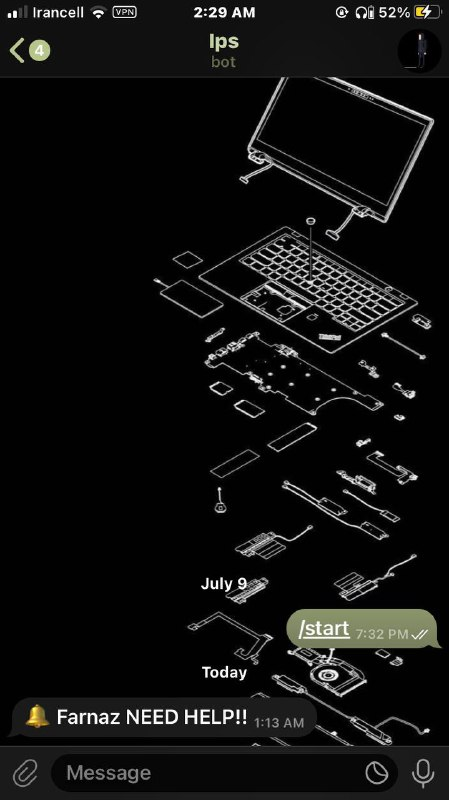

<div align="center">


# IPS – Instant Ping System  
*A Wi-Fi-enabled emergency alert button using ESP8266 and Telegram*

[](#hardware)
[](https://www.arduino.cc/)
[](https://telegram.org/)

</div>

---

## Overview

**IPS (Instant Ping System)** is a simple and effective emergency alert system based on ESP8266.  
By pressing a physical button, the system sends an instant alert message to a specified Telegram chat via a PHP server.  
Perfect for:

- 🔴 Emergency alert systems  
- 🧓 Elder assistance at home  
- 🏢 Panic buttons in offices or labs  
- 👨‍🔧 Maker projects & IoT experimentation

---

## Demo

<p align="center">
  
</p>

---

## How It Works

[ESP8266 Connects Wi-Fi] --> [Button Pressed] --> [Sends HTTP Request] --> [PHP Server Calls Telegram Bot API] --> [Message Delivered in Telegram]


The ESP8266 sends an HTTP GET request to a PHP server (hosted on Render or Replit), which then forwards the message to Telegram using the Bot API.

---

## Usage

1. **Hardware Setup**  
   - Connect the push button to the ESP8266 as follows:  
     - One side of the button to GPIO D5 (GPIO14)  
     - The other side to GND  
   - Use `INPUT_PULLUP` mode in the code to enable internal pull-up resistor.

2. **Software Configuration**  
   - Flash the ESP8266 code after updating:  
     ```cpp
     const char* ssid = "YOUR_WIFI_SSID";
     const char* password = "YOUR_WIFI_PASSWORD";
     const char* serverName = "https://your-server-url.com";
     ```
   - Make sure your PHP server is running and accessible.

3. **Power On and Connect**  
   - Power on the ESP8266; it will connect to your Wi-Fi network.  
   - Open the Serial Monitor (115200 baud) to check connection status.

4. **Press the Button**  
   - When pressed, the ESP8266 sends a request to the PHP server.  
   - The server uses Telegram Bot API to send the alert message to your chat.

5. **Check Telegram**  
   - The alert message (e.g. `🔔 Farnaz NEED HELP!!`) should appear immediately.



---

## Hardware Components

| Component       | Description                 |
|-----------------|-----------------------------|
| ESP8266 Board   | NodeMCU (ESP-12E)           |
| Push Button     | Momentary tactile switch    |
| Jumper Wires    | For connections             |
| Breadboard      | For prototyping             |
| Wi-Fi Network   | Required for connectivity   |

### Circuit Diagram

[Button] -----> [D5 (GPIO14)]
[Button] -----> [GND]

> Use `INPUT_PULLUP` to avoid external resistor.

---

## Software Setup

### Prerequisites

- Arduino IDE installed  
- ESP8266 board package installed via Board Manager  
- Libraries: `ESP8266HTTPClient.h`, `WiFiClientSecure.h`

### Flashing Code

- Open the [`ips.ino`](ips.ino) file from this repo  
- Update Wi-Fi credentials and server URL  
- Upload to your ESP8266 board

🛑 **Security Warning:**  
**Do NOT commit your real Wi-Fi credentials or bot tokens to public repositories!** Use environment variables or config files ignored by Git.

---

## Credits

Made by Farnaz𓆩♡𓆪

